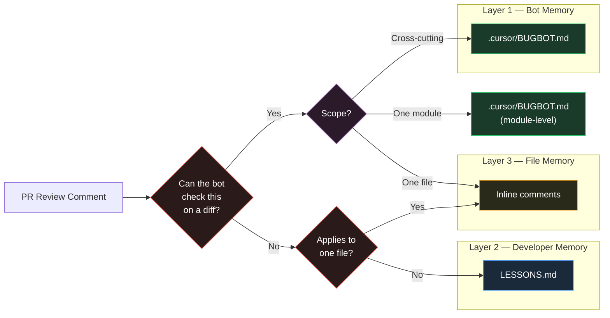
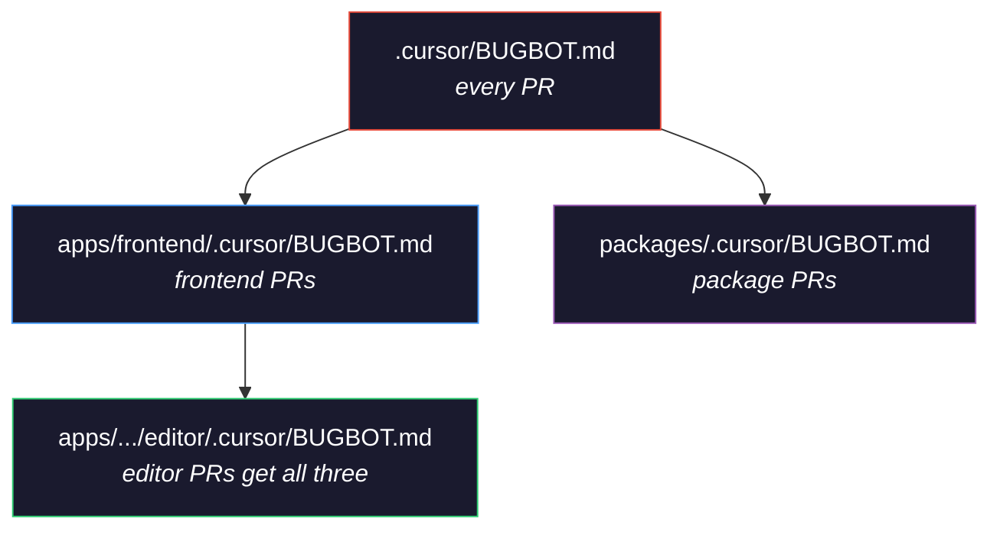
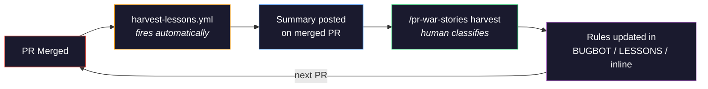

# pr-war-stories

**Stop reviewing the same bugs.**

An engineer left a PR comment three months ago. Nobody read it again. A junior dev "fixed" the code. The bot approved it. This skill makes sure that never happens again.

## What it does

`pr-war-stories` is a Claude Code skill that mines your PR history for lessons learned, then injects them where your AI code reviewer will actually use them.

```
- await Promise.all(files.map(upload))          // PR #781: OOM'd in prod
+ await asyncPool(3, files, upload)             // Now a BUGBOT.md rule
```

**Best for:** GitHub repos with substantive PR review history, teams using Cursor Bugbot or AI assistants that read repo docs (Claude Code, Cursor). Requires `gh` CLI and GitHub Actions.

## Install

```bash
claude install-skill sscarduzio/pr-war-stories
```

Then open Claude Code in any repo:

```
/pr-war-stories setup
```

The skill will explore your repo, mine your last 50 merged PRs, extract war stories from human review comments, and create everything automatically.

## Repository layout

```
SKILL.md              Entry point — concepts, command dispatch table, terminology.
commands/             One file per command. Loaded on demand.
  setup.md            Bootstrap the system (runs once per repo).
  harvest.md          Process review comments on merged PRs into rules.
  audit.md            Quarterly effectiveness review.
  rebalance.md        Promote hot-traffic modules, demote cold scopes.
  add-module.md       Create BUGBOT.md for a new complex module.
  recheck.md          Verify rules still reference real code.
reference/            Shared definitions, linked from every command.
  classification.md   REVIEWABLE / EDUCATIONAL / SINGLE-FILE / OVERLAPPING / STALE taxonomy.
  quality-bar.md      Format and quality criteria for each layer.
  anti-patterns.md    Canonical list of what NOT to do.
  graduation.md       When to retire a rule into lint/test/CI.
templates/
  harvest-lessons.yml The GitHub Action installed by `/pr-war-stories setup`.
docs/                 The landing page at sscarduzio.github.io/pr-war-stories — not part of the skill.
```

You only ever need to touch `SKILL.md` and the `commands/` / `reference/` files when improving the skill. The `templates/harvest-lessons.yml` is copied verbatim into `.github/workflows/` during setup; edit it in a target repo, not here.

## The three-layer architecture

Not all knowledge belongs in the same place:



| Layer | File | When it's read | What goes here |
|-------|------|---------------|----------------|
| **Bot rules** | `.cursor/BUGBOT.md` | Bugbot reviews a PR | Rules the bot can enforce on a diff |
| **Lessons** | `LESSONS.md` | Developer starts coding | Concrete before/after code examples |
| **Inline** | Source code comments | That file appears in a diff | Single-file warnings |

### What does NOT belong

- **If it can be linted or tested deterministically**, graduate it out of BUGBOT.md and into a linter rule or test. BUGBOT is for fuzzy, contextual knowledge that needs understanding intent.
- **Style preferences** ("prefer early returns", "use descriptive names") belong in linter config, not BUGBOT.md.
- **Suggestions that were discussed but rejected** are design decisions, not rules.

## Hierarchical scoping

BUGBOT.md files are hierarchical. The bot traverses **upward** from each changed file, collecting rules at every level:



Token budget stays under control:

- **< 400 words** per file (ideal)
- **< 2000 tokens** worst-case combined load

### Cross-cutting rules & refactor survival

- Cross-module rules go in the **root** BUGBOT.md. Don't duplicate into module files.
- If the same bug recurs in a different module, **promote the rule upward**.
- After big refactors: run `/pr-war-stories recheck` to catch rules referencing moved/deleted code.

## The automated feedback loop



No knowledge falls through the cracks.

## Commands

| Command | When | What |
|---------|------|------|
| `/pr-war-stories setup` | Once per repo | Full bootstrap from PR history |
| `/pr-war-stories harvest` | When harvest summaries appear | Classify new lessons, place in the right layer |
| `/pr-war-stories recheck` | After big refactors | Verify all rules reference code that still exists |
| `/pr-war-stories audit` | Quarterly | Measure hit rate, prune stale rules, graduate to lint |
| `/pr-war-stories add-module <path>` | New complex module added | Bootstrap scoped rules for it |

### Automated (no human trigger)

| What | When |
|------|------|
| `harvest-lessons.yml` GitHub Action | Every PR merge — extracts substantive human comments, posts harvest summary |

## Real war stories

These are actual rules extracted from production PRs:

```diff
# PR #781 — Production OOM → BUGBOT.md
- await Promise.all(files.map(upload))
+ await asyncPool(3, files, upload)

# PR #775 — LLM CSS broke schema editor → BUGBOT.md
- .custom-antlayout { height: 100% }
+ .schema-editor-layout { height: 100% }

# PR #748 — Bot flagged === as bug → Inline comment
- if (deepEqual(prev, next))
+ if (prev === next) // intentional ref check

# PR #741 — useState 1 frame late → LESSONS.md
- const [val, setVal] = useState(x)
+ const valRef = useRef(x) // sync capture
```

After setup, Bugbot caught a real bug in the harvest workflow itself — the scope detection used `else if` instead of `if`, causing files to miss parent scope rules. The system was already paying for itself.

## Example LESSONS.md entries

Every lesson has concrete `// WRONG` / `// RIGHT` code. Here are three from a real frontend repo:

### Promise.all on unbounded arrays causes OOM

```ts
// WRONG: OOM on large file lists
await Promise.all(files.map(f => uploadFile(f)));

// RIGHT: bounded parallelism
import pLimit from 'p-limit';
const limit = pLimit(3);
await Promise.all(files.map(f => limit(() => uploadFile(f))));
```
*(PR #781)*

### Use null to clear fields, not undefined

```ts
// WRONG: field silently omitted from payload
const update = { name: "new", description: undefined };
JSON.stringify(update); // '{"name":"new"}' — description not cleared

// RIGHT: null explicitly clears the field
const update = { name: "new", description: null };
JSON.stringify(update); // '{"name":"new","description":null}'
```

### Reference equality (===) can be intentional

```tsx
// The bot flagged this as a bug:
if (prev === next) return; // "should be deepEqual"

// But this was intentional — MemoryStorageAdapter preserves references.
// Deep equality would defeat the optimization.
if (prev === next) return; // intentional ref check — see PR #748
```
*(PR #748)*

And from a Python backend repo:

### Always add ON CLUSTER to ClickHouse mutations

```sql
-- WRONG: only affects one node
ALTER TABLE my_table UPDATE col = 'x' WHERE id = 1

-- RIGHT: affects all replicas
ALTER TABLE my_table ON CLUSTER '{cluster}' UPDATE col = 'x' WHERE id = 1
```
*(PRs #573, #572)*

### Use model_dump() to access Pydantic v2 extra fields

```python
# WRONG: silently misses ontology fields
for field in field_names:
    value = getattr(entity, field)  # None for extra fields!

# RIGHT: gets all fields including extras
data = entity.model_dump()
for field in field_names:
    value = data.get(field)
```
*(PR #528)*

**Drop aggressively.** 8 concrete lessons beat 15 vague ones. If you can't show the wrong way and the right way in code, it doesn't belong in LESSONS.md.

## Requirements

- GitHub repo with merged PRs (or any codebase — the skill bootstraps from code reading if PR history is thin)
- [`gh` CLI](https://cli.github.com/) authenticated
- [Cursor Bugbot](https://www.cursor.com/dashboard/bugbot) enabled (free) — or any reviewer that reads `.cursor/BUGBOT.md`
- [Claude Code](https://claude.ai/code)

## FAQ

**Does this work without Cursor Bugbot?**
Yes. LESSONS.md works with any IDE assistant. Inline comments work with any reviewer. The harvest Action works regardless. BUGBOT.md files just need a compatible consumer.

**Does this work with CodeRabbit / Copilot?**
LESSONS.md and inline comments work with anything. BUGBOT.md is Cursor-specific but the format could be adapted.

**Won't BUGBOT.md rot like every other living doc?**
The quarterly audit catches staleness: rules that never trigger get removed, fixed patterns get graduated to lint. The harvest Action keeps fresh ones coming in.

**How long does setup take?**
5-15 minutes. The skill parallelizes PR mining.

**Will this slow down CI?**
The harvest Action runs only on merged PRs, takes ~10 seconds, uses no external services, and only posts a comment when there are substantive human review comments.

**What if we have very few PRs?**
The skill falls back to bootstrapping from code reading — it looks for TODO/FIXME/HACK comments, complex untested functions, and git blame hotspots.

**What about big refactors / module renames?**
Run `/pr-war-stories recheck`. It greps every rule for path/function references, verifies they still exist, and flags stale `scopeRules` prefixes. Reports but does not auto-fix — you decide whether to update, remove, or promote each rule.

**What if a reviewer's suggestion wasn't adopted?**
Rejected suggestions are not rules. The harvest step filters for this: only corrections that were actually adopted, and warnings about real pitfalls, become rules.

## Links

- [Landing page](https://sscarduzio.github.io/pr-war-stories/)
- [Presentation slides](https://sscarduzio.github.io/pr-war-stories/presentation.html)

## License

MIT
